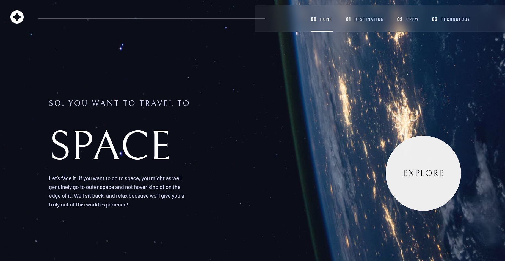
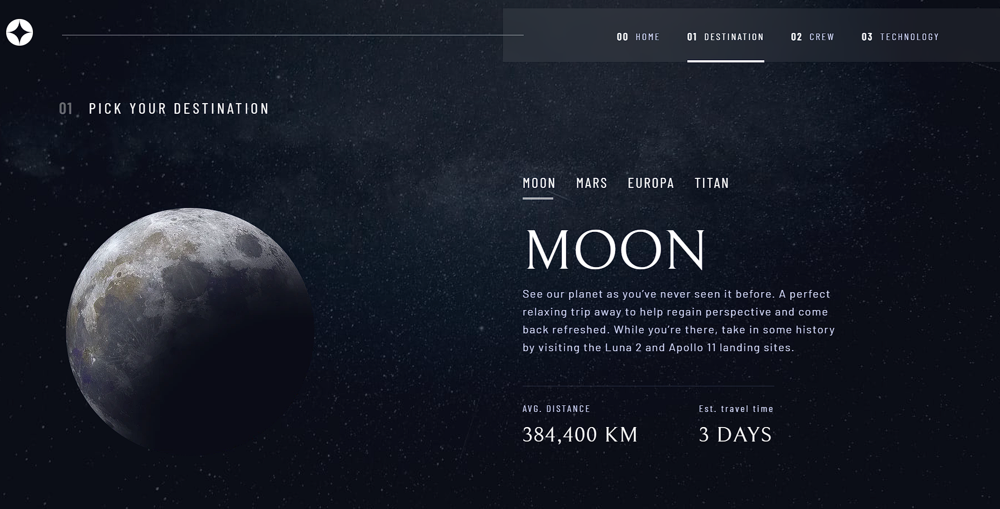
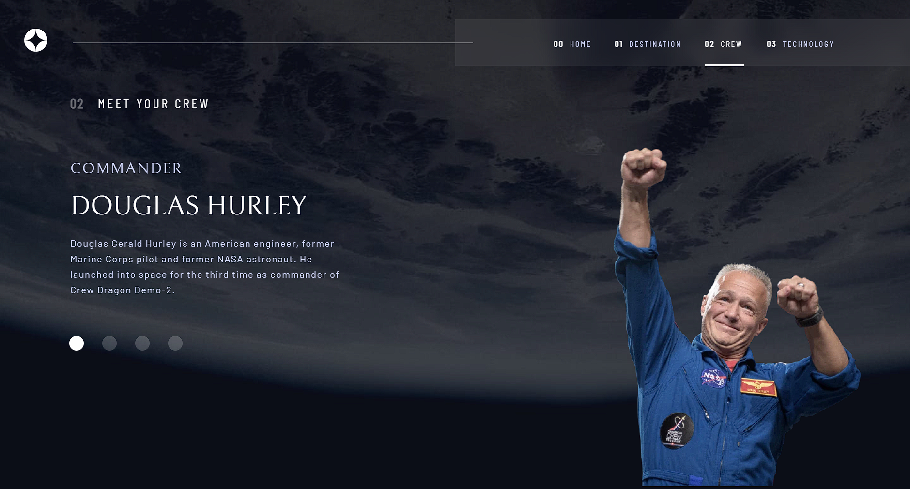
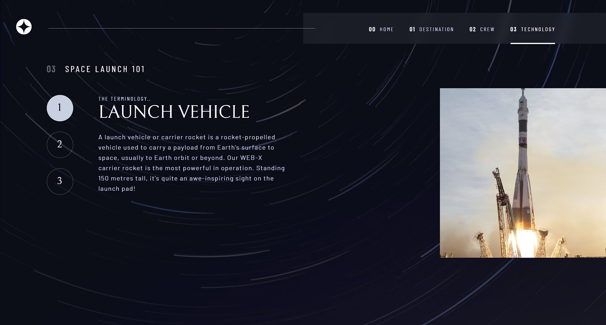
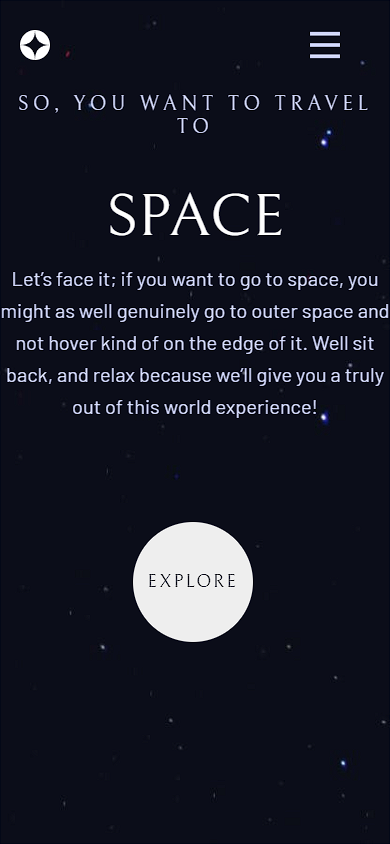
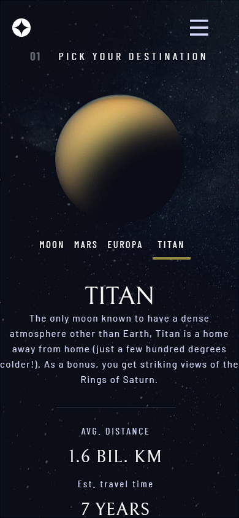
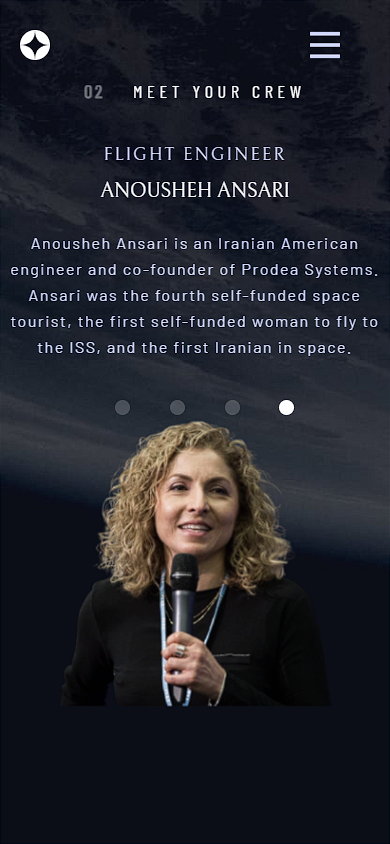
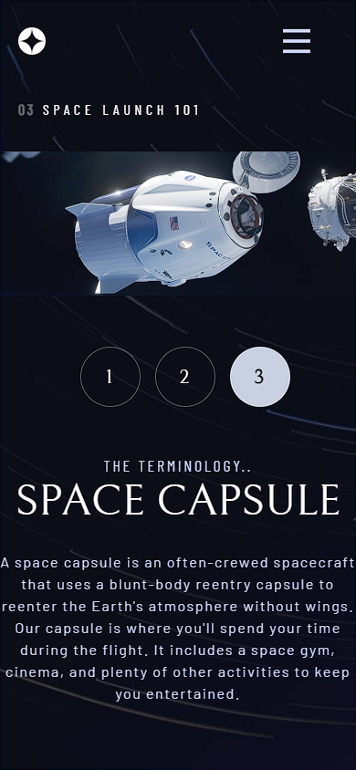

<h1 align="center">Space Tourism🚀👨‍🚀</h1>

<h4 align="center">
    This project is a challenge that I took from <a href="https://www.frontendmentor.io/challenges/space-tourism-multipage-website-gRWj1URZ3">frontendmentor.io </a> which consists of building a multi-page space tourism website  and get it looking as close to the design as possible.
</h4>

 

<h4 align = "center">
    <a align="center" href="https://www.frontendmentor.io/solutions/responsive-landing-page-with-html-sass-js-3bxKOMxrxW">Front-end mentor challenge.</a> /// <a href="https://gustavojuvino.github.io/Space-Tourism/">Space-Tourism Website</a>
</h4>

 

<h6 align="center"> This project was created with:</h6>
 
 

  
  
  
  
 

  

<!-- Desktop -->
<h2 align="center">Desktop Version 🖥️</h2>

  

<h2 align="center">Mobile Version 📱</h2>

<!--Made By Gustavo J. Souza -->
